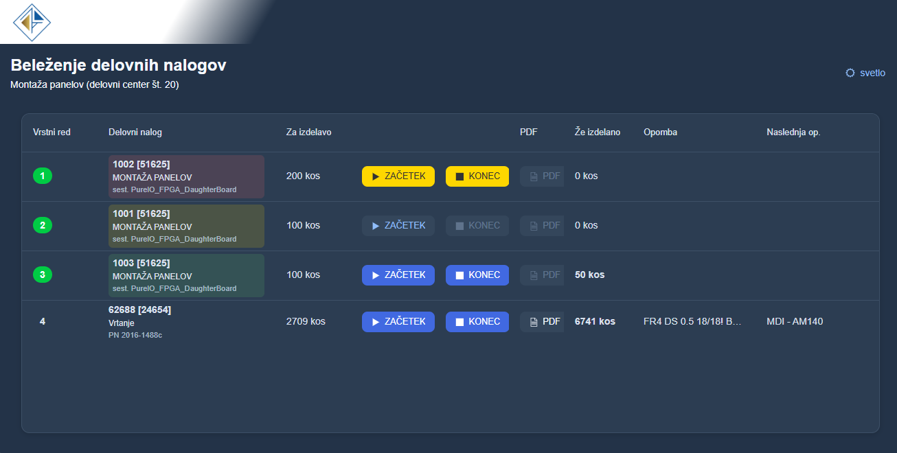
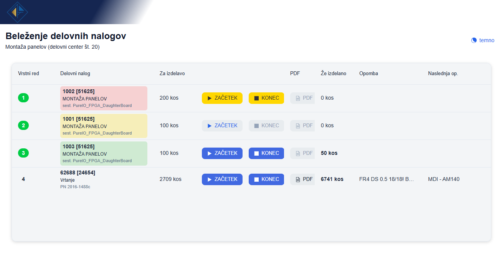
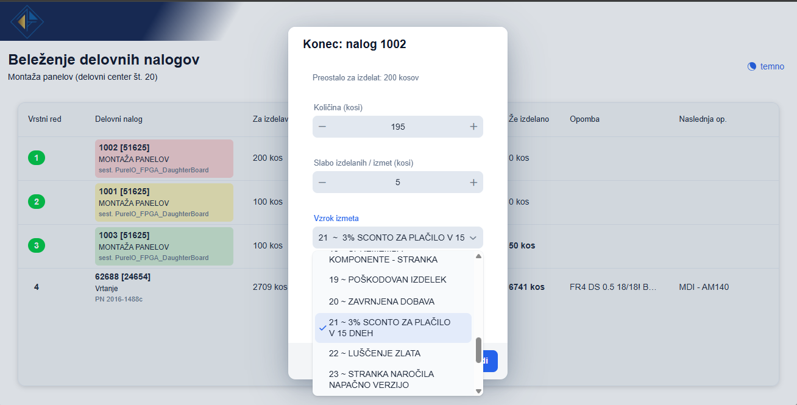

<a id="vrh"></a>
# WorkOrder

A web application for real-time live tracking and logging of production workers’ activities and labor in the manufacturing process.
Built with Java 21, Spring Boot, Vaadin 25, and JPA/Hibernate connecting to Microsoft SQL Server.



## What it does

The dashboard displays current production tasks prioritized by urgency and execution order. Since multiple workers can operate simultaneously, a live overview of all active tasks and worker activities is essential for efficient coordination and workflow management.
Work orders can be completed partially, while operators can also add notes, report scrap quantities, and specify the causes of production waste or defects.



## Getting Started

Those are instructions on setting up your project locally. To get a local copy up and running follow these simple steps.

### Requrements

 For all **Java/Maven** projects everything is **already defined** in `pom.xml`. Maven downloads all dependencies automatically when you `run mvn spring-boot:run`, so you just need to download theese manually.

- Java 21 (JDK, not just JRE)
- Maven
- Network access to the SQL Server (VPN or local)


### Setup

Clone this repository:

```git clone https://github.com/split-hue/WorkOrder.git```

Open `src/main/resources/application.properties` and fill in your DB credentials:

```
spring.datasource.url=jdbc:sqlserver:DATABASE;databaseName=DATABASE-NAME;encrypt=false;trustServerCertificate=true
spring.datasource.username=YOUR_DB_USERNAME
spring.datasource.password=YOUR_DB_PASSWORD
```
### Run

Make sure you are connected to the network (or VPN), then open the terminal in the root of the project (where `pom.xml` is) and run:

```mvn spring-boot:run```

Now open your browser at http://localhost:8080

## Project structure

```bash

src/main/java/com/workorder/
│
├── Application.java
│
├── ui/
│   └── DelovniNalogView.java
│
├── service/
│   └── DelovniNalogService.java
│
├── model/
│   ├── DelovniNalogDto.java
│   ├── Evidencaur.java
│   └── PotekDelovnegaNaloga.java
│
└── repository/
    └── DelovniNalogRepository.java

```
## Local network setup - example

### Generate `.jar` file
```bash
mvn clean package -DskipTests
```
It would skip the test file and your file is now created at `target/workorder-1.0-SNAPSHOT.jar`. If having issues first double-click on 'maven' (right panel) > 'clean' and then again on 'maven' > 'target' to do the same thing. 

### Generate documentation (optional)
```bash
mvn javadoc:javadoc
```
Then open `target/site/apidocs/index.html` in your browser.

### Make scripts

If you do not have Java 21 installed on your computer (or it is not added to your PATH) and you don’t want to modify your system configuration, download a `Java 21 .zip` package from the [Download Java 21](https://adoptium.net/en-GB/temurin/releases?version=21) and extract it into this directory as `\java21`.

Place the previously built `.jar` file in this directory as well.

Now create Windows batch (`.bat`) files for starting and stopping the application.

To run the start script automatically, use Task Scheduler with the following settings:

- Program/script: C:\apps\workOrder\start.bat
- Add arguments: *(leave empty)*
- Start in: C:\apps\workOrder


## Author :bird:

<div align="center">
  <a href="https://github.com/split-hue">
    
    <br/>
    <b>@split-hue</b>
  </a>
</div>

<p align="right"><a href="#vrh">back to top</a></p>
